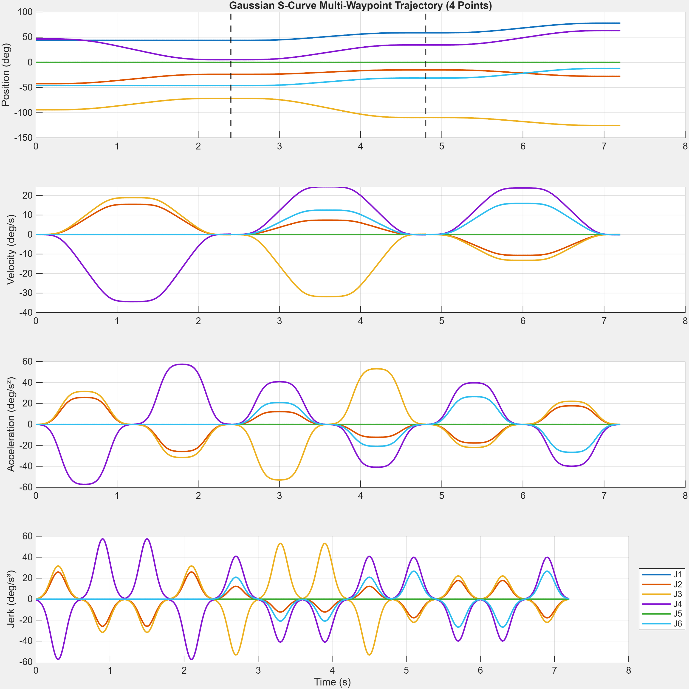
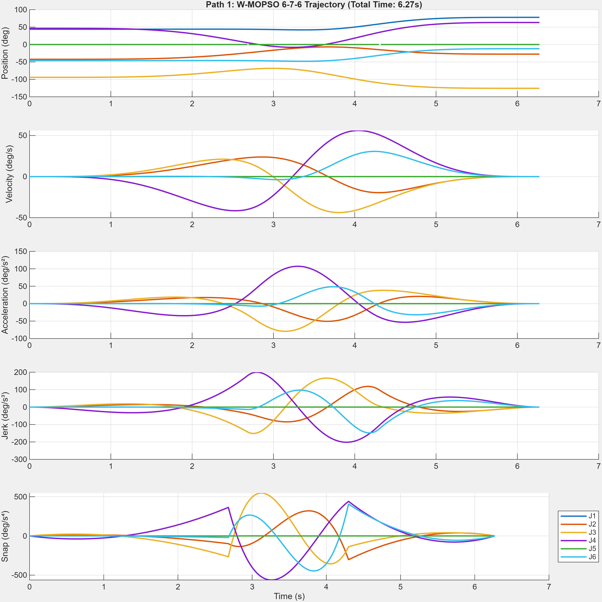
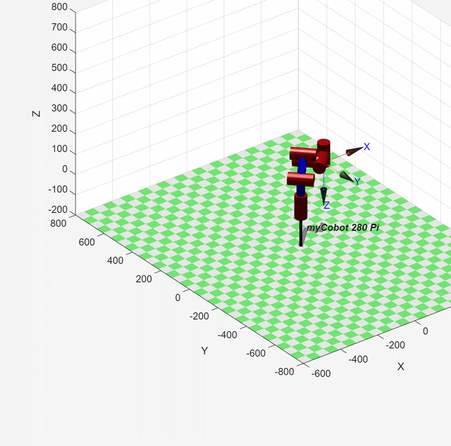

# Optimal-Time Trajectory Planning for Robotic Systems with Smooth Jerk
### MS Thesis Research — Electrical & Computer Engineering, Purdue University Northwest


## Overview

Industrial trajectory planners face a tradeoff between speed and smoothness: pushing execution time down tends to push jerk up, and high jerk is what wears out joints and gearboxes. This repo hosts the code, results, and full write-up behind my MS thesis, which optimizes both at once — time and jerk — for a 6-DOF manipulator, and validates the result on real hardware rather than stopping at simulation.

**[Read the full thesis →](thesis/TanyaradzwaChinyai_2026Thesis.pdf)**

## The Problem That Started This

Both the UR3 and the myCobot 280 Pi showed visibly jerky motion that never appeared in the MATLAB simulation. The cause: an encoder baud-rate ceiling on the physical controllers, capping how fast joint-angle updates could actually be reported and executed — a hardware constraint the simulation didn't model. The fix was modifying the trajectory solver's main loop to respect that update-rate ceiling.

This is the finding that shaped the rest of the project: a trajectory that looks optimal in MATLAB isn't optimal until it's been run on the actual hardware.

## Approach

The core contribution is a **Weighted Multi-Objective Particle Swarm Optimization (W-MOPSO)** algorithm that generates **Gaussian S-curve trajectories** for a 6-DOF manipulator, jointly optimizing execution time and jerk. It's benchmarked against two standard trajectory profiles used as baselines — **3-5-3** and **6-7-6** segmented polynomials — across 5 spatial test configurations (named Path 1–5 in the code).

- IK solver: warm-start chaining across waypoints (each solved pose seeds the next)
- W-MOPSO time-optimization: 30-particle swarm, 100 iterations, optimizing segment duration parameters against a cost that penalizes velocity/acceleration/jerk-limit violations
- Hard limits enforced during optimization: velocity ≤ 160 deg/s, acceleration ≤ 300 deg/s², jerk ≤ 200 deg/s³

### Gaussian S-Curve vs. 6-7-6 Baseline — Path 1 Kinematic Profiles

| W-MOPSO Gaussian S-Curve (novel) | 6-7-6 Polynomial (baseline) |
|---|---|
|  |  |

### Hardware-in-the-Loop Animation — Path 1

| W-MOPSO Gaussian S-Curve | 6-7-6 Baseline |
|---|---|
|  |  |

All 5 test paths, both algorithms, both plot types (kinematic profiles + end-effector Cartesian tracking) are in [`assets/results/`](assets/results/).

## Repository Contents

- **`src/core/`** — shared helper functions used by every planner: forward/inverse kinematics for the myCobot 280 Pi (`flink6dofelephant.m`, `ilink6dofelephant_hybrid.m`), the 6-7-6 polynomial segment solver (`construct_676_full_numerical.m`), the objective function (`objfxyz.m`), and a rotation-matrix utility (`rpy2rotm.m`)
- **`src/run_gaussian_planner_time_optimised.m`** — the W-MOPSO + Gaussian S-curve planner (the novel algorithm): solves IK across all 5 test paths, runs the PSO time-optimization per segment, and reports kinematic and Cartesian-tracking results
- **`src/run_676_planner_time_optimised.m`** / **`run_676_planner_time_specific.m`** — the 6-7-6 polynomial baseline used for comparison, run across all 5 paths
- **`assets/results/`** — kinematic-profile and end-effector-tracking plots for both algorithms across all 5 test paths, plus one animated hardware-in-the-loop visualization per algorithm
- **`thesis/`** — the full thesis document
- **`publications/southeastcon-2025/`** — paper + slides for the related SoutheastCon 2025 publication (co-authored, X. Zhou lead)

## Results (from the full thesis study)

- **10–20% reduction** in execution time vs. the 3-5-3 / 6-7-6 baselines, across the 5 test configurations
- **Tradeoff:** 15% of motions were *longer* after optimization — the algorithm isn't a strict win on every trial, it trades some execution time for reduced mechanical wear on the joints
- Jerk **mathematically bounded below 200 deg/s³** — this is a guaranteed design bound built into the optimization, not an empirically observed reduction (the Path 1 plot above shows actual peak jerk around ±60 deg/s³, well inside that bound)
- Hardware-in-the-loop validation on the myCobot 280 Pi via Python/ROS2, following MATLAB simulation

## Hardware

- **UR3** — where the encoder baud-rate limitation was diagnosed
- **myCobot 280 Pi** — used for hardware-in-the-loop validation via ROS2/Python

## Repository Structure

```text
├── assets/
│   └── results/
│       ├── 676-baseline/          # 10 plots + 1 animation (6-7-6 polynomial)
│       └── gaussian-wmopso/       # 10 plots + 1 animation (W-MOPSO Gaussian S-curve)
├── publications/
│   └── southeastcon-2025/         # Paper + slides for the SoutheastCon 2025 publication
├── src/
│   ├── core/                      # Shared kinematics + trajectory-construction functions
│   ├── run_gaussian_planner_time_optimised.m   # Novel W-MOPSO algorithm
│   ├── run_676_planner_time_optimised.m        # Baseline
│   └── run_676_planner_time_specific.m         # Baseline (fixed segment durations)
├── thesis/
│   └── TanyaradzwaChinyai_2026Thesis.pdf
├── LICENSE                        # CC BY 4.0
└── README.md
```

## Roadmap

- [x] Upload the W-MOPSO optimizer + Gaussian S-curve trajectory generator
- [x] Add the thesis PDF
- [x] Add jerk/velocity smoothness plots and hardware-in-the-loop animations
- [ ] Add the ROS2/Python hardware-in-the-loop validation code
- [ ] Package the ROS2 code as a standalone, launchable ROS2 package

## Related Publications

- **T. Chinyai** (lead author), L. Tan, M. Yao. "Time-Optimal Trajectory Planning for Robotic Manipulators with Differentiable Jerk Minimization." *IEEE UEMCON 2025.*
- X. Zhou (lead author), **T. Chinyai** (experiment setup & results validation), L. Tan. "Multi-objective optimization for inverse kinematics of robotic arm with joint configuration." *IEEE SoutheastCon 2025*, pp. 514–519. → [paper](publications/southeastcon-2025/paper.pdf) · [slides](publications/southeastcon-2025/slides.pdf) (slides authored/presented by X. Zhou)
- MS Thesis: *"Optimal-Time Trajectory Planning for Robotic Systems with Smooth Jerk,"* Purdue University Northwest. → [full PDF](thesis/TanyaradzwaChinyai_2026Thesis.pdf)

## License

CC BY 4.0 — see [LICENSE](LICENSE).
